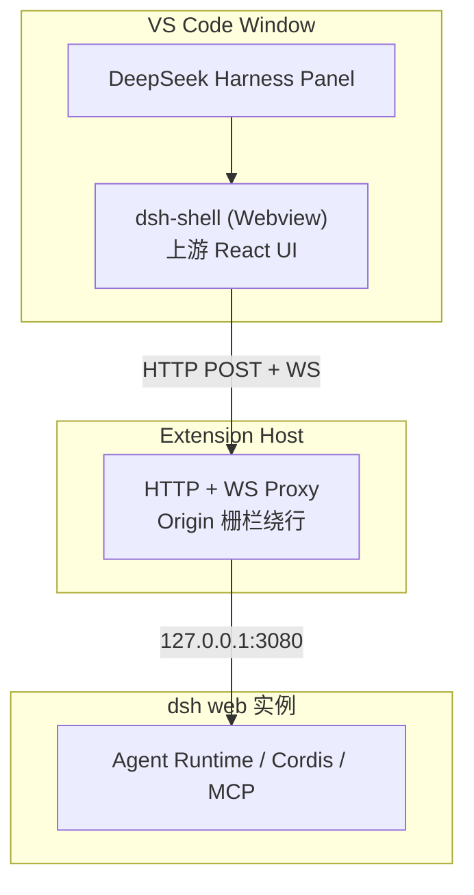

# DeepSeek Harness for VS Code

DeepSeek Harness 的 VS Code 客户端。连接已运行的 `dsh web` 实例（127.0.0.1:3080），把 Agent UI 带进 IDE——不需要浏览器，不需要额外 runtime。

A VS Code client for DeepSeek Harness. Connects to a running `dsh web` instance (127.0.0.1:3080) and brings the full Agent UI into your IDE — no browser, no extra runtime.

## 快速开始 / Quick Start

```sh
# 1. 启动 dsh 实例
npx @deepseek-ai/dsh web
# 首次聊天前在 Settings → Models 配置 API Key，或 DEEPSEEK_API_KEY

# 2. 克隆并构建
git clone --recurse-submodules https://github.com/mrtsels/dsh-for-vs-code.git
cd dsh-for-vs-code
pnpm install

# 3. 构建 vendor UI + 扩展
cd vendor/deepseek-harness
corepack pnpm install --ignore-scripts
corepack pnpm run build:lib:host && corepack pnpm run build:lib:client && corepack pnpm run build:web
cd ../..
pnpm build && pnpm build:shell

# 4. 启动扩展开发宿主
code -n --extensionDevelopmentPath=$PWD/apps/vscode $PWD
```

## 架构 / Architecture



**核心思路**：插件是 `dsh web` 的客户端，映射同一 runtime，不另起实例。UI 由上游原生 React 组件从 vendor 源码构建装配。

### 构建管线 / Build Pipeline

```
vendor/deepseek-harness (submodule, 锁 rev, 只读)
  ├─ build:lib:client  → 各 client 包 lib/client.js（插件 bundle）
  ├─ build:web         → apps/web/dist（上游 shell）
  └─ build-web-shell.mjs → dist/web/dsh-shell/（index.html + boot 图 + 插件 + shell.css）
                                              │
VS Code webview (chat-panel.ts: 注入 CSP/base/__DSH_WEB_URL__)
        │  HTTP POST + WS（经扩展侧代理，绕行 Origin 栅栏）
        ▼
dsh web 实例 @ 127.0.0.1:3080
```

### 源码地图 / Source Map

```
apps/vscode/
├─ src/agent/       runtime.ts（薄桥）· session-manager.ts · controller.ts
├─ src/vscode/      proxy.ts（Origin 栅栏绕行）· workspace · terminal · editor/git
├─ src/webview/     chat-panel.ts（dsh-shell 宿主）· changes-panel.ts（审查面板）
├─ src/commands/    ask · agent · review · chat-participant · native
├─ src/api/         DshWebApiClient（HTTP RPC）
├─ dist/web/dsh-shell/   上游 UI 构建产物
└─ scripts/         build-web-shell.mjs（装配）· smoke-shell.mjs（E2E 冒烟）
```

## 功能 / Features

- **Chat 面板**：上游原生 React UI 裁剪装配。子代理、后台任务、Todo、目标、轨迹视图
- **主题同步**：上游 --dsw-* 语义色全量映射 VS Code 主题变量
- **首开体验**：首次打开自动进入当前工作区的新会话
- **设置映射**：agentPreset / permissionMode / locale / theme 双向同步
- **改动审查**：agent 写盘 → 快照 diff → 一键回滚/接受
- **文件/选区附着**：Explorer 拖入 → chip，发送时文件内容随消息注入
- **审批**：工具请求弹原生通知，允许/拒绝
- **会话管理**：独立页面，新建/切换/重命名/分叉/归档
- **原生入口**：`@DeepSeek Harness` participant、右键菜单、Code Actions
- **连接管理**：命令面板切换地址、重试、验证

详细功能说明见 [apps/vscode/README.md](apps/vscode/README.md)。

## 开发 / Development

### 前置条件

- Node.js ≥ 22.19
- pnpm（项目锁定版本见 `packageManager` 字段）
- dsh 0.1.0-rc.7
- 系统 Chrome（headless smoke 测试用）

### 常用命令

| 命令 | 用途 |
|------|------|
| `pnpm build` | 构建扩展 + dsh-attachment-ui + session-view |
| `pnpm build:shell` | 装配 dsh-shell（build-web-shell.mjs） |
| `pnpm typecheck` | TypeScript 类型检查 |
| `pnpm lint` | oxlint 检查 |
| `pnpm test` | vitest 单元测试 |
| `node apps/vscode/scripts/smoke-shell.mjs` | headless Chrome E2E 冒烟 |

### Vendor 构建

修改 vendor 源码后必须重跑 lib 构建（产物不入外层 workspace）：

```sh
cd vendor/deepseek-harness
corepack pnpm install --ignore-scripts
corepack pnpm run build:lib:host && corepack pnpm run build:lib:client && corepack pnpm run build:web
cd ../..
pnpm build:shell
```

⚠️ **只改源码不 rebuild lib → shell 产物仍是旧版**。build-web-shell.mjs 从 `vendor/lib/client.js` 拷贝插件。

### 提交门 / G0 Gate

提交前全绿：

```sh
pnpm typecheck && pnpm lint && pnpm test && pnpm build
```

集成测试（连 3080）标 `@live`，`LIVE_3080=1` 才跑，无服务可跳过。

### 关键约定

- 不 fork 上游、vendor 只读锁 rev（见 [AGENTS.md](AGENTS.md) 红线）
- `src/agent/runtime.ts` 只做传输，不含业务逻辑
- UI 由上游组件 + 上游 connection 层驱动，扩展不自维护 messages[]
- 文件写走 WorkspaceEdit（快照 diff + 回滚）
- terminal 走 VS Code Terminal API，禁裸 child_process
- ESM everywhere；TypeScript strict；注册即 effect

## 已知限制 / Known Limitations

- Agent 写盘不可截获，采用「快照 diff + 一键回滚」方案
- MCP 服务器状态、job 取消、sandbox 状态无上游 API（[docs/gaps.md](docs/gaps.md)）
- 服务仅绑定 127.0.0.1、无鉴权

## 相关仓库 / Related Repos

- [deepseek-harness](https://github.com/deepseek-ai/deepseek-harness) — 上游 Agent Runtime
- [dsh-file-attach](https://github.com/mrtsels/dsh-file-attach) — 文件附着插件

## License

[LGPL-2.1](LICENSE)
