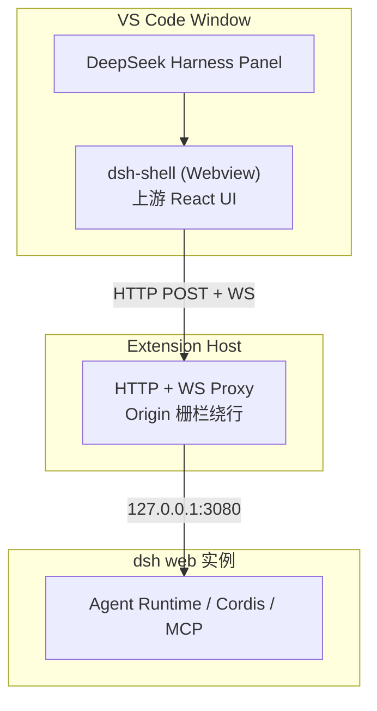
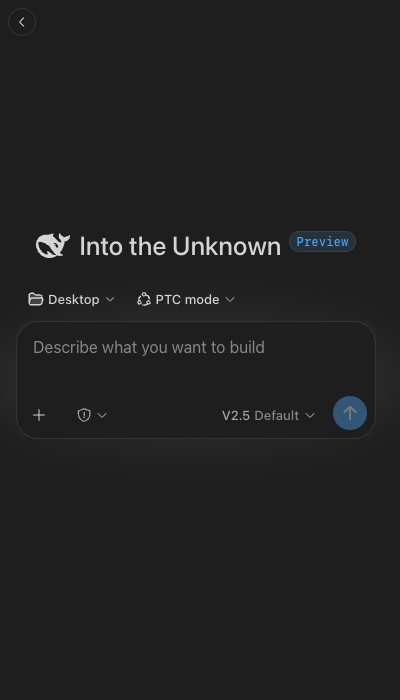
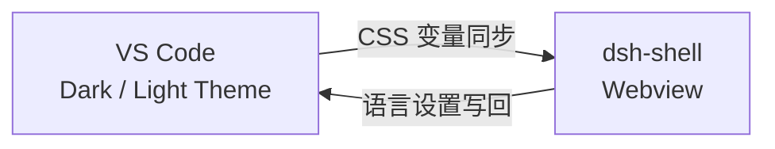
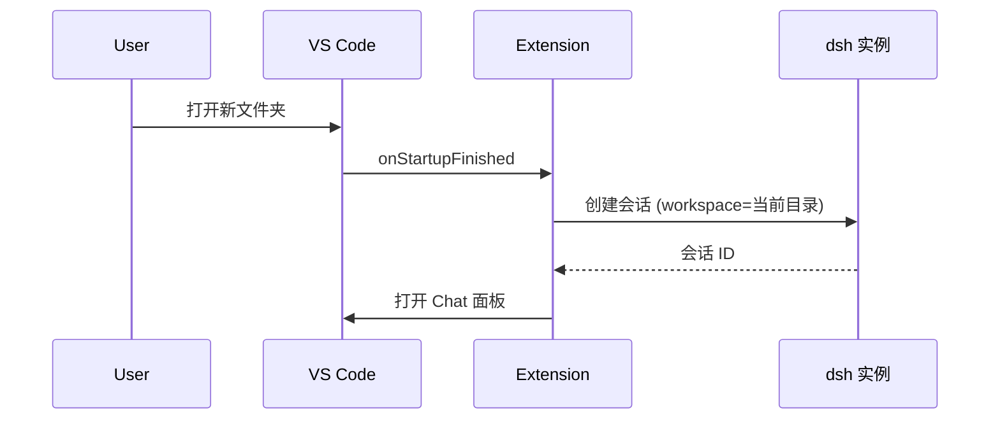
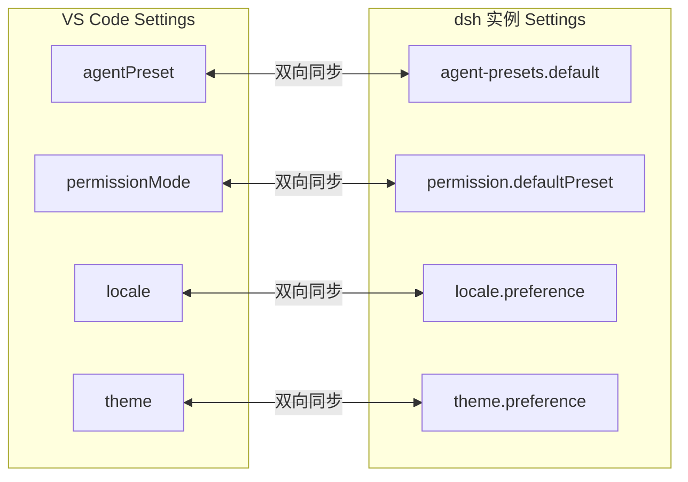
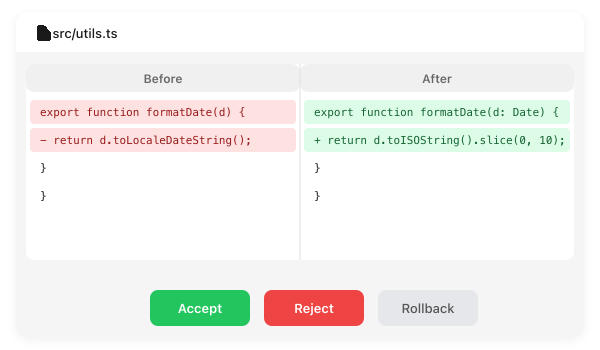
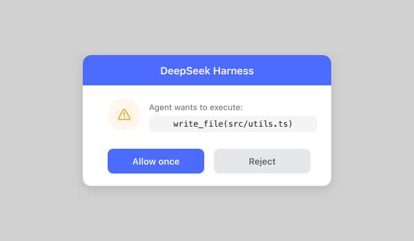
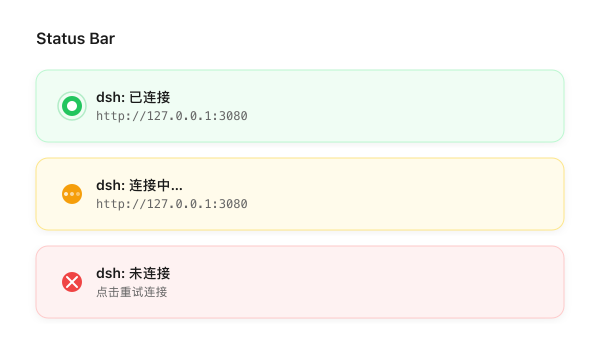
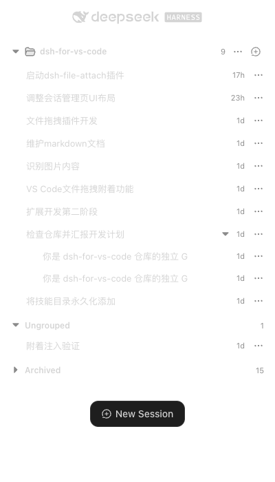

# DeepSeek Harness for VS Code

- DeepSeek Harness 的 VS Code 客户端。连接已运行的 `dsh web` 实例（127.0.0.1:3080），把 Agent UI 带进你的 IDE——不需要浏览器，不需要额外 runtime。位于 VS Code 侧边栏，与 Codex、Claude Code 等 AI 编程助手同级位置，开箱即用。
- A VS Code client for DeepSeek Harness. Connects to a running `dsh web` instance (127.0.0.1:3080) and brings the full Agent UI into your IDE — no browser, no extra runtime. Lives in the VS Code sidebar alongside Codex, Claude Code, and other AI coding assistants.

## 架构 / Architecture



## 功能 / Features

### 对话面板 / Chat Panel

- 基于上游 DeepSeek Harness 原生 React UI 裁剪装配，非自研。支持子代理、后台任务、Todo 追踪、目标和轨迹视图。
- Built from upstream DeepSeek Harness native React components (not custom UI). Supports sub-agents, background tasks, todo tracking, goals, and trajectory view.



### 主题与语言同步 / Theme & Locale Sync

- 自动跟随 VS Code 主题和配色方案。语言跟随 VS Code 设置自动切换。
- Automatically follows your VS Code theme, color scheme, and language settings.



### 首次打开体验 / First-Open Experience

- 首次打开项目时自动创建以当前工作区为范围的新 Agent 会话。
- Automatically creates a new agent session scoped to your current workspace when you first open a project.



### 设置同步 / Settings Sync

- Agent 预设、权限模式、语言、主题和忙碌时行为与 dsh 实例双向同步。
- Agent preset, permission mode, locale, theme, and busy-enter behavior are two-way synced with the dsh instance.



### 改动审查 / Change Review

- Agent 修改文件时，diff 面板捕获每次改动。一键审查、接受或回滚。
- When the agent modifies files, a diff panel captures every change. Review, accept, or roll back with one click.



### 文件与选区附着 / File & Selection Attachment

- 从 Explorer 拖拽文件到对话输入区附着为 chip。随时切换「附着活动文件」或「附着选中内容」。大文件和二进制文件自动处理。
- Drag files from Explorer into the chat input to attach them as chips. Toggle "attach active file" or "attach selection" anytime. Large files and binaries are handled gracefully.
- 推荐搭配 **dsh-file-attach** 插件，将文件和代码选区系统性注入 Agent 提示词，模型可直接读取文件内容作为上下文。
- Recommended companion **dsh-file-attach** plugin — systematically injects file and code selections into the agent's prompt so the model can directly read file contents as context.

```bash
# 一键安装 / One-line install
bash <(curl -fsSL https://raw.githubusercontent.com/mrtsels/dsh-file-attach/main/scripts/install.sh)
```

详见 [dsh-file-attach README](https://github.com/mrtsels/dsh-file-attach#readme)。

### 审批提示 / Approval Prompts

- 工具执行请求通过原生 VS Code 通知弹出。允许一次或拒绝——完全控制 Agent 的操作权限。
- Tool execution requests show native VS Code notifications. Allow once or reject — full control over what the agent can do.



### 原生入口 / Native Entry Points

- 在 VS Code Chat 中使用 `@DeepSeek Harness`，或通过编辑器右键菜单和 Code Actions 访问。
- Use `@DeepSeek Harness` in VS Code Chat, or access via editor context menu and Code Actions.

### 连接管理 / Connection Management

- 在命令面板中切换 dsh 实例地址、重试连接、验证连接状态。
- Switch dsh instance address, retry connections, and verify connectivity from the command palette.



Command Palette 可用命令 / Available commands:

- `DeepSeek Harness: 切换实例地址` — Switch instance address
- `DeepSeek Harness: 重试连接` — Retry connection
- `DeepSeek Harness: 验证连接` — Verify connection
- `DeepSeek Harness: 查看/选择模型` — View/select model
- `DeepSeek Harness: 选择 Agent Preset` — Select agent preset

### 会话管理 / Session Management

- 独立的会话管理页面：新建、切换、重命名、分叉和归档会话。
- Dedicated session management page: create, switch, rename, fork, and archive sessions.



## 开发中 / In Development

以下功能后端已有预留，但前后端尚未完全打通，暂不可用：

The following features have backend stubs but are not yet fully wired end-to-end:

### 终端捕获 / Terminal Capture

- 后端已实现 Pseudoterminal 输出捕获（`terminal.ts`），但上游 dsh UI 尚无终端输入组件触发 `terminal:run` 消息。
- Backend captures terminal output via Pseudoterminal (`terminal.ts`), but the upstream dsh UI lacks a terminal input component to trigger it.

### 编辑器集成 / Editor Integration

- 右键菜单「解释选中代码」「Ask to fix 诊断」已注册（`native.ts`），但上下文自动注入（当前文件、诊断、git 状态）与聊天面板的联动尚未完全打通。
- Right-click menu items "Explain Selection" and "Ask to Fix Diagnostics" are registered (`native.ts`), but automatic context injection (current file, diagnostics, git status) is not yet fully wired to the chat panel.

### 逐写拦截 / Write Interception

- 计划在文件写入时逐次拦截审批，当前仅有预留钩子（`workspace.ts` P2-7）。现有方案为「快照 diff + 一键回滚」。
- Planned per-write interception with approval hooks (`workspace.ts` P2-7). Current approach uses snapshot diff + one-click rollback.

### MCP 服务器状态 / MCP Server Status

- 无上游 API 支持查询 MCP 服务器运行状态，按「文档化降级」处理。
- No upstream API to query MCP server status; documented as degraded.

### Job 取消 / Job Cancellation

- 无上游 API 支持取消正在运行的后台任务。
- No upstream API to cancel running background jobs.

### Sandbox 状态 / Sandbox Status

- Sandbox 模式状态仅通过事件流推送 projection，无独立查询端点。
- Sandbox mode status is only available via event stream projections; no standalone query endpoint.
